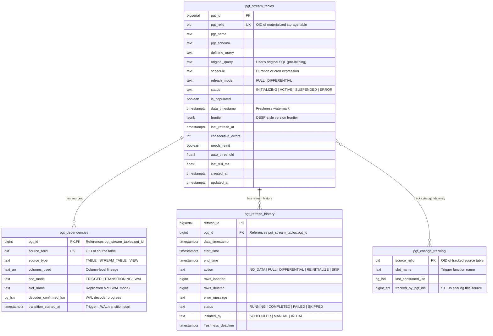

# Architecture

This document describes the internal architecture of pg_trickle — a PostgreSQL 18 extension that implements stream tables with differential view maintenance.
For a high-level description of what pg_trickle does and why, read [ESSENCE.md](../ESSENCE.md). For release milestones and future plans, see [ROADMAP.md](../ROADMAP.md).

---

## High-Level Overview

```
┌─────────────────────────────────────────────────────────────────┐
│                     PostgreSQL 18 Backend                       │
│                                                                 │
│  ┌──────────┐   ┌──────────┐   ┌──────────┐   ┌─────────────┐   │
│  │  Source  │   │  Source  │   │  Storage │   │  Storage    │   │
│  │  Table A │   │  Table B │   │  Table X │   │  Table Y    │   │
│  └────┬─────┘   └────┬─────┘   └────▲─────┘   └────▲────────┘   │
│       │              │              │              │            │
│  ═════╪══════════════╪══════════════╪══════════════╪════════    │
│       │              │              │              │            │
│  ┌────▼──────────────▼────┐   ┌────┴──────────────┴────┐        │
│  │  Hybrid CDC Layer      │   │  Delta Application     │        │
│  │  Triggers ──or── WAL   │   │  (INSERT/DELETE diffs) │        │
│  └────────────┬───────────┘   └────────────▲───────────┘        │
│               │                            │                    │
│  ┌────────────▼───────────┐   ┌────────────┴───────────┐        │
│  │   Change Buffer        │   │   DVM Engine           │        │
│  │   (pgtrickle_changes.*) │   │   (Operator Tree)      │        │
│  └────────────┬───────────┘   └────────────▲───────────┘        │
│               │                            │                    │
│               └────────────┬───────────────┘                    │
│                            │                                    │
│  ┌─────────────────────────▼─────────────────────────────┐      │
│  │              Refresh Engine                           │      │
│  │  ┌──────────┐  ┌──────────┐  ┌─────────────────────┐  │      │
│  │  │ Frontier │  │ DAG      │  │ Scheduler           │  │      │
│  │  │ Tracker  │  │ Resolver │  │ (canonical schedule)│  │      │
│  │  └──────────┘  └──────────┘  └─────────────────────┘  │      │
│  └───────────────────────────────────────────────────────┘      │
│                                                                 │
│  ┌────────────────────────────────────────────────────────┐     │
│  │                    Catalog (pgtrickle.*)                │     │
│  │  pgt_stream_tables │ pgt_dependencies │ pgt_refresh_history│  │
│  └────────────────────────────────────────────────────────┘     │
│                                                                 │
│  ┌──────────────────────────────────────────────────────┐       │
│  │                  Monitoring Layer                    │       │
│  │  st_refresh_stats │ slot_health │ check_cdc_health    │       │
│  │  explain_st │ views │ NOTIFY alerting               │       │
│  └──────────────────────────────────────────────────────┘       │
└─────────────────────────────────────────────────────────────────┘
```

---

## Component Details

### 1. SQL API Layer (`src/api.rs`)

The public entry point for users. All operations are exposed as `#[pg_extern]` functions in the `pgtrickle` schema:

- **create_stream_table** — Applies a chain of auto-rewrite passes (view inlining → DISTINCT ON → GROUPING SETS → scalar subquery → SubLinks in OR → multi-PARTITION BY windows), parses the defining query, builds an operator tree, creates the storage table, registers CDC slots, populates the catalog, and optionally performs an initial full refresh.
- **alter_stream_table** — Modifies schedule, refresh mode, or status (ACTIVE/SUSPENDED).
- **drop_stream_table** — Removes the storage table, catalog entries, and cleans up CDC slots.
- **refresh_stream_table** — Triggers a manual refresh (same path as automatic scheduling).
- **pgt_status** — Returns a summary of all registered stream tables.

### 2. Catalog (`src/catalog.rs`)

The catalog manages persistent metadata stored in PostgreSQL tables within the `pgtrickle` schema:

| Table | Purpose |
|---|---|
| `pgtrickle.pgt_stream_tables` | Core metadata: name, query, schedule, status, frontier, etc. |
| `pgtrickle.pgt_dependencies` | DAG edges from ST to source tables |
| `pgtrickle.pgt_refresh_history` | Audit log of every refresh operation |
| `pgtrickle.pgt_change_tracking` | Per-source CDC slot metadata |

Schema creation is handled by `extension_sql!()` macros that run at `CREATE EXTENSION` time.

#### Entity-Relationship Diagram



> **Note:** Change buffer tables (`pgtrickle_changes.changes_<oid>`) are created dynamically per source table OID and live in the separate `pgtrickle_changes` schema.

### 3. CDC / Change Data Capture (`src/cdc.rs`, `src/wal_decoder.rs`)

pg_trickle uses a **hybrid CDC** architecture that starts with triggers and optionally transitions to WAL-based (logical replication) capture for lower write-side overhead.

#### Trigger Mode (default)

1. **Trigger Management** — Creates `AFTER INSERT OR UPDATE OR DELETE` row-level triggers (`pg_trickle_cdc_<oid>`) on each tracked source table. Each trigger fires a PL/pgSQL function (`pg_trickle_cdc_fn_<oid>()`) that writes changes to the buffer table.
2. **Change Buffering** — Decoded changes are written to per-source change buffer tables in the `pgtrickle_changes` schema. Each row captures the LSN (`pg_current_wal_lsn()`), transaction ID, action type (I/U/D), and the new/old row data as JSONB via `to_jsonb()`.
3. **Cleanup** — Consumed changes are deleted after each successful refresh via `delete_consumed_changes()`, bounded by the upper LSN to prevent unbounded scans.
4. **Lifecycle** — Triggers and trigger functions are automatically created when a source table is first tracked and dropped when the last stream table referencing a source is removed.

The trigger approach was chosen as the default for **transaction safety** (triggers can be created in the same transaction as DDL), **simplicity** (no slot management, no `wal_level = logical` requirement), and **immediate visibility** (changes are visible in buffer tables as soon as the source transaction commits).

#### WAL Mode (optional, automatic transition)

When `pg_trickle.cdc_mode` is set to `'auto'` or `'wal'` and `wal_level = logical` is available, the system transitions from trigger-based to WAL-based CDC after the first successful refresh:

1. **WAL Availability Detection** — At stream table creation, checks whether `wal_level = logical` is configured. If so, the source dependency is marked for WAL transition.
2. **WAL Decoder Background Worker** — A dedicated background worker (`src/wal_decoder.rs`) polls logical replication slots and writes decoded changes into the same change buffer tables used by triggers, ensuring a uniform format for the DVM engine.
3. **Transition Orchestration** — The transition is a three-step process: (a) create a replication slot, (b) wait for the decoder to catch up to the trigger's last confirmed LSN, (c) drop the trigger and switch the dependency to WAL mode. If the decoder doesn't catch up within `pg_trickle.wal_transition_timeout` (default 300s), the system falls back to triggers.
4. **CDC Mode Tracking** — Each source dependency in `pgt_dependencies` carries a `cdc_mode` column (TRIGGER / TRANSITIONING / WAL) and WAL-specific metadata (`slot_name`, `decoder_confirmed_lsn`, `transition_started_at`).

See ADR-001 and ADR-002 in [plans/adrs/PLAN_ADRS.md](../plans/adrs/PLAN_ADRS.md) for the original design rationale and [plans/sql/PLAN_HYBRID_CDC.md](../plans/sql/PLAN_HYBRID_CDC.md) for the full implementation plan.

### 4. DVM Engine (`src/dvm/`)

The Differential View Maintenance engine is the core of the system. It transforms the defining SQL query into an executable operator tree that can compute deltas efficiently.

#### Auto-Rewrite Pipeline (`src/dvm/parser.rs`)

Before the defining query is parsed into an operator tree, it passes through a chain of auto-rewrite passes that normalize SQL constructs the DVM parser doesn't handle directly:

| Pass | Function | Purpose |
|------|----------|---------|
| #0 | `rewrite_views_inline()` | Replace view references with `(view_definition) AS alias` subqueries |
| #1 | `rewrite_distinct_on()` | Convert `DISTINCT ON` to `ROW_NUMBER() OVER (…) = 1` window subquery |
| #2 | `rewrite_grouping_sets()` | Decompose `GROUPING SETS` / `CUBE` / `ROLLUP` into `UNION ALL` of `GROUP BY` |
| #3 | `rewrite_scalar_subquery_in_where()` | Convert `WHERE col > (SELECT …)` to `CROSS JOIN` |
| #4 | `rewrite_sublinks_in_or()` | Split `WHERE a OR EXISTS (…)` into `UNION` branches |
| #5 | `rewrite_multi_partition_windows()` | Split multiple `PARTITION BY` clauses into joined subqueries |

The view inlining pass (#0) runs first so that view definitions containing DISTINCT ON, GROUPING SETS, etc. are further rewritten by downstream passes. Nested views are expanded via a fixpoint loop (max depth 10).

#### Query Parser (`src/dvm/parser.rs`)

Parses the defining query using PostgreSQL's internal parser (via pgrx `raw_parser`) and extracts:
- **WITH clause** — CTE definitions (non-recursive: inline expansion or shared delta; recursive: detected for mode gating)
- **Target list** — output columns
- **FROM clause** — source tables, joins, subqueries, and CTE references
- **WHERE clause** — filters
- **GROUP BY / aggregate functions**
- **DISTINCT / UNION ALL / INTERSECT / EXCEPT**

The parser produces an `OpTree` — a tree of operator nodes. CTE handling follows a tiered approach:

1. **Tier 1 (Inline Expansion)** — Non-recursive CTEs referenced once are expanded into `Subquery` nodes, equivalent to subqueries in FROM.
2. **Tier 2 (Shared Delta)** — Non-recursive CTEs referenced multiple times produce `CteScan` nodes that share a single delta computation via a CTE registry and delta cache.
3. **Tier 3a/3b/3c (Recursive)** — Recursive CTEs (`WITH RECURSIVE`) are detected via `query_has_recursive_cte()`. In FULL mode, the query executes as-is. In DIFFERENTIAL mode, the strategy is auto-selected: semi-naive evaluation for INSERT-only changes, Delete-and-Rederive (DRed) for mixed changes, or recomputation fallback when CTE columns don't match ST storage.

#### Operators (`src/dvm/operators/`)

Each operator knows how to generate a **delta query** — given a set of changes to its inputs, it produces the corresponding changes to its output:

| Operator | Delta Strategy |
|---|---|
| **Scan** | Direct passthrough of CDC changes |
| **Filter** | Apply WHERE predicate to deltas |
| **Project** | Apply column projection to deltas |
| **Join** | Join deltas against the other side's current state |
| **OuterJoin** | LEFT/RIGHT outer join with NULL padding |
| **FullJoin** | FULL OUTER JOIN with 8-part delta (both sides may produce NULLs) |
| **Aggregate** | Recompute group values where affected keys changed |
| **Distinct** | COUNT-based duplicate tracking |
| **UnionAll** | Merge deltas from both branches |
| **Intersect** | Dual-count multiplicity with LEAST boundary crossing |
| **Except** | Dual-count multiplicity with GREATEST(0, L-R) boundary crossing |
| **Subquery** | Transparent delegation + optional column renaming (CTEs, subselects) |
| **CteScan** | Shared delta lookup from CTE cache (multi-reference CTEs) |
| **RecursiveCte** | Semi-naive / DRed / recomputation for `WITH RECURSIVE` |
| **Window** | Partition-based recomputation for window functions |
| **LateralFunction** | Row-scoped recomputation for SRFs in FROM (jsonb_array_elements, unnest, etc.) |
| **LateralSubquery** | Row-scoped recomputation for correlated subqueries in LATERAL FROM |
| **SemiJoin** | EXISTS / IN subquery delta via semi-join |
| **AntiJoin** | NOT EXISTS / NOT IN subquery delta via anti-join |
| **ScalarSubquery** | Correlated scalar subquery in SELECT list |

See [DVM_OPERATORS.md](DVM_OPERATORS.md) for detailed descriptions.

#### Diff Engine (`src/dvm/diff.rs`)

Generates the final diff SQL that:
1. Computes the delta from the operator tree
2. Produces `('+', row)` for inserts and `('-', row)` for deletes
3. Applies the diff via `DELETE` matching old rows and `INSERT` for new rows

### 5. DAG / Dependency Graph (`src/dag.rs`)

Stream tables can depend on other stream tables (cascading), forming a Directed Acyclic Graph:

- **Cycle detection** — Prevents circular dependencies at creation time using DFS.
- **Topological ordering** — Determines refresh order: upstream STs must be refreshed before downstream STs.
- **Cascade operations** — When a source table changes, all transitive dependents are identified for refresh.

### 6. Version / Frontier Tracking (`src/version.rs`)

Implements a per-source **frontier** (JSONB map of `source_oid → LSN`) to track exactly how far each stream table has consumed changes:

- **Read frontier** — Before refresh, read the frontier to know where to start consuming changes.
- **Advance frontier** — After a successful refresh, the frontier is updated to the latest consumed LSN.
- **Consistent snapshots** — The frontier ensures that each refresh processes a contiguous, non-overlapping window of changes.

#### Delayed View Semantics (DVS) Guarantee

The contents of every stream table are logically equivalent to evaluating its defining query at some past point in time — the `data_timestamp`. The scheduler refreshes STs in **topological order** so that when ST B references upstream ST A, A has already been refreshed to the target `data_timestamp` before B runs its delta query against A's contents. The frontier lifecycle is:

1. **Created** — on first full refresh; records the LSN of each source at that moment.
2. **Advanced** — on each differential refresh; the old frontier becomes the lower bound and the new frontier (with fresh LSNs) the upper bound. The DVM engine reads changes in `[old, new]`.
3. **Reset** — on reinitialize; a fresh frontier is created from scratch.

### 7. Refresh Engine (`src/refresh.rs`)

Orchestrates the complete refresh cycle:

```
┌──────────────┐
│  Check State │ → Is ST active? Has it been populated?
└──────┬───────┘
       │
 ┌─────▼──────┐
 │ Drain CDC  │ → Read WAL changes into change buffer tables
 └─────┬──────┘
       │
 ┌─────▼──────────────┐
 │ Determine Action   │ → FULL, DIFFERENTIAL, NO_DATA, REINITIALIZE, or SKIP?
 │                    │   (adaptive: if change ratio > pg_trickle.differential_max_change_ratio,
 │                    │    downgrade DIFFERENTIAL → FULL automatically)
 └─────┬──────────────┘
       │
 ┌─────▼──────┐
 │ Execute    │ → Full: TRUNCATE + INSERT ... SELECT
 │            │   Differential: Generate & apply delta SQL
 └─────┬──────┘
       │
 ┌─────▼──────────────┐
 │ Record History     │ → Write to pgtrickle.pgt_refresh_history
 └─────┬──────────────┘
       │
 ┌─────▼──────────────┐
 │ Advance Frontier   │ → Update JSONB frontier in catalog
 └─────┬──────────────┘
       │
 ┌─────▼──────────────┐
 │ Reset Error Count  │ → On success, reset consecutive_errors to 0
 └──────────────────────┘
```

### 8. Background Worker & Scheduling (`src/scheduler.rs`)

#### Registration & Lifecycle

pg_trickle registers **one PostgreSQL background worker** — the *scheduler* — during `_PG_init()` (extension load). Because it is registered at startup, `pg_trickle` **must** appear in `shared_preload_libraries`, which requires a server restart.

```
┌──────────────────────────────────────────────────────────────────┐
│                  PostgreSQL postmaster                           │
│                                                                  │
│  shared_preload_libraries = 'pg_trickle'                          │
│       │                                                          │
│       ▼                                                          │
│  _PG_init()                                                      │
│    ├─ Register GUCs (pg_trickle.enabled, scheduler_interval_ms …) │
│    ├─ Register shared memory (PgTrickleSharedState, atomics)      │
│    └─ BackgroundWorkerBuilder::new("pg_trickle scheduler")        │
│         .set_start_time(RecoveryFinished)                        │
│         .set_restart_time(5s)       ← auto-restart on crash      │
│         .load()                                                  │
│                                                                  │
│  After recovery finishes:                                        │
│       │                                                          │
│       ▼                                                          │
│  pg_trickle_scheduler_main()         ← background worker starts   │
│    ├─ Attach SIGHUP + SIGTERM handlers                           │
│    ├─ Connect to SPI (database = "postgres")                     │
│    ├─ Crash recovery: mark stale RUNNING records as FAILED       │
│    └─ Enter main loop ─────────────────────────┐                 │
│         │                                      │                 │
│         ▼                                      │                 │
│     wait_latch(scheduler_interval_ms)          │                 │
│         │                                      │                 │
│     ┌───▼───────────────────────────────┐      │                 │
│     │ SIGTERM? → log + break            │      │                 │
│     │ pg_trickle.enabled = false? → skip │      │                 │
│     │ Otherwise → scheduler tick        │      │                 │
│     └───┬───────────────────────────────┘      │                 │
│         │                                      │                 │
│         └──────────── loop ────────────────────┘                 │
└──────────────────────────────────────────────────────────────────┘
```

Key lifecycle properties:

| Property | Behaviour |
|---|---|
| **Start condition** | After PostgreSQL recovery finishes (`RecoveryFinished`) |
| **Auto-restart** | 5-second delay after an unexpected crash |
| **Graceful shutdown** | Handles `SIGTERM` — breaks the main loop and exits cleanly |
| **Config reload** | Handles `SIGHUP` — re-reads GUC values on the next latch wake |
| **Crash recovery** | On startup, any `pgt_refresh_history` rows stuck in `RUNNING` status are marked `FAILED` (the transaction that wrote them was rolled back by PostgreSQL, but the status row may have been committed in a prior transaction) |
| **Database** | Connects to the `postgres` database via SPI |

#### Scheduler Tick

Each tick of the main loop performs the following steps inside a single transaction:

1. **DAG rebuild** — Compare the shared-memory `DAG_REBUILD_SIGNAL` counter against the local copy. If it advanced (a `CREATE`, `ALTER`, or `DROP` stream table occurred), rebuild the in-memory dependency graph (`StDag`) from the catalog.
2. **Topological traversal** — Walk stream tables in dependency order (upstream before downstream). This ensures that when ST B references ST A, A is refreshed first.
3. **Per-ST evaluation** — For each active ST:
   - Skip if in retry backoff (exponential, per-ST).
   - Skip if schedule/cron says not yet due.
   - Skip if an advisory lock indicates a concurrent refresh.
   - Check upstream change buffers for pending rows.
4. **Execute refresh** — Acquire an advisory lock → record `RUNNING` in history → run `FULL` / `DIFFERENTIAL` / `REINITIALIZE` → store new frontier → release lock → record completion.
5. **WAL transitions** — Advance any trigger→WAL CDC mode transitions (`src/wal_decoder.rs`).
6. **Slot health** — Check replication slot health and emit `NOTIFY` alerts.
7. **Prune retry state** — Remove backoff entries for STs that no longer exist.

#### Sequential Processing

**The scheduler processes stream tables sequentially within a single background worker.** Although `pg_trickle.max_concurrent_refreshes` (default 4) exists as a GUC, it currently only prevents a manual `pgtrickle.refresh_stream_table()` call from overlapping with the scheduler on the *same* ST — it does not spawn additional workers. All STs are refreshed one at a time in topological order.

The PostgreSQL GUC `max_worker_processes` (default 8) sets the server-wide budget for *all* background workers (autovacuum, parallel query, logical replication, extensions). pg_trickle consumes **one** slot from that budget.

#### Retry & Error Handling

Each ST maintains an in-memory `RetryState` (reset on scheduler restart):

- **Retryable errors** (SPI failures, lock contention, slot issues) trigger exponential backoff.
- **Permanent errors** (schema mismatch, user errors) skip backoff but increment `consecutive_errors`.
- When `consecutive_errors` reaches `pg_trickle.max_consecutive_errors` (default 3), the ST is auto-suspended and a `NOTIFY` alert is emitted.
- Schema errors additionally set `needs_reinit`, triggering a `REINITIALIZE` on the next successful cycle.

#### Scheduling Policy

Automatic refresh scheduling uses **canonical periods** (48·2ⁿ seconds, n = 0, 1, 2, …) snapped to the user's `schedule`:

- Picks the smallest canonical period ≤ `schedule`.
- For **DOWNSTREAM** schedule (NULL schedule), the ST refreshes only when explicitly triggered or when a downstream ST needs it.
- Advisory locks prevent concurrent refreshes of the same ST.
- The scheduler is driven by the background worker polling at the `pg_trickle.scheduler_interval_ms` GUC interval.

#### Shared Memory (`src/shmem.rs`)

The scheduler background worker and user sessions share a `PgTrickleSharedState` structure protected by a `PgLwLock`. Key fields:

| Field | Type | Purpose |
|---|---|---|
| `dag_version` | `u64` | Incremented when the ST catalog changes; used by the scheduler to detect when the DAG needs rebuilding. |
| `scheduler_pid` | `i32` | PID of the scheduler background worker (0 if not running). |
| `scheduler_running` | `bool` | Whether the scheduler is active. |
| `last_scheduler_wake` | `i64` | Unix timestamp of the last scheduler wake cycle (for monitoring). |

A separate `PgAtomic<AtomicU64>` named `DAG_REBUILD_SIGNAL` is incremented by API functions (`create`, `alter`, `drop`) after catalog mutations. The scheduler compares its local copy against the atomic counter to detect when to rebuild its in-memory DAG without holding a lock.

A second `PgAtomic<AtomicU64>` named `CACHE_GENERATION` tracks DDL events that may invalidate cached delta or MERGE templates across backends. When DDL hooks fire (view change, ALTER TABLE, function change) or API functions mutate the catalog, `CACHE_GENERATION` is bumped. Each backend maintains a thread-local generation counter; on the next refresh, if the shared generation has advanced, the backend flushes its delta template cache, MERGE template cache, and prepared statements.

### 9. DDL Tracking (`src/hooks.rs`)

Event triggers monitor DDL changes to source tables and functions:

- **`_on_ddl_end`** — Fires on `ALTER TABLE` to detect column adds/drops/type changes. If a source table used by a ST is altered, the ST's `needs_reinit` flag is set. Also detects `CREATE OR REPLACE FUNCTION` / `ALTER FUNCTION` — if the function appears in a ST's `functions_used` catalog column, the ST is marked for reinit.
- **`_on_sql_drop`** — Fires on `DROP TABLE` to set `needs_reinit` for affected STs. Also detects `DROP FUNCTION` and marks affected STs for reinit.
- **Function name extraction** — `object_identity` strings (e.g., `public.my_func(integer, text)`) are parsed to extract the bare function name, which is matched against the `functions_used TEXT[]` column in `pgt_stream_tables`.

Reinitialization is deferred until the next refresh cycle, which then performs a `REINITIALIZE` action (drop and recreate the storage table from the updated query).

### 10. Error Handling (`src/error.rs`)

Centralized error types using `thiserror`:

- `PgTrickleError` variants cover catalog access, SQL execution, CDC, DVM, DAG, and config errors.
- Each refresh failure increments `consecutive_errors`.
- When `consecutive_errors` reaches `pg_trickle.max_consecutive_errors` (default 3), the ST is moved to `ERROR` status and suspended from automatic refresh.
- Manual intervention (`ALTER ... status => 'ACTIVE'`) resets the counter.

### 11. Monitoring (`src/monitor.rs`)

Provides observability functions:

- **st_refresh_stats** — Aggregate statistics (total/successful/failed refreshes, avg duration, staleness status).
- **get_refresh_history** — Per-ST audit trail.
- **get_staleness** — Current staleness in seconds.
- **slot_health** — Checks replication slot state and WAL retention.
- **check_cdc_health** — Per-source CDC health status including mode, slot lag, confirmed LSN, and alerts.
- **explain_st** — Describes the DVM plan for a given ST.
- **Views** — `pgtrickle.stream_tables_info` (computed staleness) and `pgtrickle.pg_stat_stream_tables` (combined stats).

#### NOTIFY Alerting

Operational events are broadcast via PostgreSQL `NOTIFY` on the `pg_trickle_alert` channel. Clients can subscribe with `LISTEN pg_trickle_alert;` and receive JSON-formatted events:

| Event | Condition |
|---|---|
| `stale` | data staleness exceeds 2× `schedule` |
| `auto_suspended` | ST suspended after `pg_trickle.max_consecutive_errors` failures |
| `reinitialize_needed` | Upstream DDL change detected |
| `slot_lag_warning` | Replication slot WAL retention is growing |
| `cdc_transition_complete` | Source transitioned from trigger to WAL-based CDC |
| `cdc_transition_failed` | Trigger→WAL transition failed (fell back to triggers) |
| `refresh_completed` | Refresh completed successfully |
| `refresh_failed` | Refresh failed with an error |

### 12. Row ID Hashing (`src/hash.rs`)

Provides deterministic 64-bit row identifiers using **xxHash (xxh64)** with a fixed seed. Two SQL functions are exposed:

- **`pgtrickle.pg_trickle_hash(text)`** — Hash a single text value; used for simple single-column row IDs.
- **`pgtrickle.pg_trickle_hash_multi(text[])`** — Hash multiple values (separated by a record-separator byte `\x1E`) for composite keys (join row IDs, GROUP BY keys).

Row IDs are written into every stream table's storage as an internal `__pgt_row_id BIGINT` column and are used by the delta application phase to match `DELETE` candidates precisely.

### 13. Configuration (`src/config.rs`)

Twelve GUC (Grand Unified Configuration) variables control runtime behavior, plus five performance-tuning GUCs. See [CONFIGURATION.md](CONFIGURATION.md) for details.

| GUC | Default | Purpose |
|---|---|---|
| `pg_trickle.enabled` | `true` | Master on/off switch for the scheduler |
| `pg_trickle.scheduler_interval_ms` | `1000` | Scheduler background worker wake interval (ms) |
| `pg_trickle.min_schedule_seconds` | `60` | Minimum allowed `schedule` |
| `pg_trickle.max_consecutive_errors` | `3` | Errors before auto-suspending a ST |
| `pg_trickle.change_buffer_schema` | `pgtrickle_changes` | Schema for change buffer tables |
| `pg_trickle.max_concurrent_refreshes` | `4` | Maximum parallel refresh workers |
| `pg_trickle.differential_max_change_ratio` | `0.15` | Change-to-table-size ratio above which DIFFERENTIAL falls back to FULL |
| `pg_trickle.cleanup_use_truncate` | `true` | Use `TRUNCATE` instead of `DELETE` for change buffer cleanup when the entire buffer is consumed |
| `pg_trickle.user_triggers` | `'auto'` | User-defined trigger handling: `auto` / `on` / `off` |
| `pg_trickle.block_source_ddl` | `false` | Block column-affecting DDL on tracked source tables instead of reinit |
| `pg_trickle.cdc_mode` | `'trigger'` | CDC mechanism: `trigger` / `auto` / `wal` |
| `pg_trickle.wal_transition_timeout` | `300` | Max seconds to wait for WAL decoder catch-up during transition |
| `pg_trickle.merge_planner_hints` | `true` | Inject `SET LOCAL` planner hints (disable nestloop, raise work_mem) before MERGE |
| `pg_trickle.merge_work_mem_mb` | `64` | `work_mem` (MB) applied when delta exceeds 10 000 rows and planner hints enabled |
| `pg_trickle.use_prepared_statements` | `true` | Use SQL PREPARE/EXECUTE for cached MERGE templates |

---

## Data Flow: End-to-End Refresh

```
 Source Table INSERT/UPDATE/DELETE
           │
           ▼
 Hybrid CDC Layer:
   ┌─────────────────────────────────────────────┐
   │ TRIGGER mode: Row-Level AFTER Trigger        │
   │   pg_trickle_cdc_fn_<oid>() → buffer table    │
   │                                              │
   │ WAL mode: Logical Replication Slot           │
   │   wal_decoder bgworker → same buffer table   │
   └─────────────────────────────────────────────┘
           │
           ▼
 Change Buffer Table (pgtrickle_changes.changes_<oid>)
   Columns: change_id, lsn, xid, action (I/U/D), row_data (jsonb)
           │
           ▼
 DVM Engine: generate delta SQL from operator tree
   - Scan operator reads from change buffer
   - Filter/Project/Join transform the deltas
   - Aggregate recomputes affected groups
           │
           ▼
 Diff Engine: produce (+/-) diff rows
           │
           ▼
 Delta Application:
   DELETE FROM storage WHERE __pgt_row_id IN (removed)
   INSERT INTO storage SELECT ... FROM (added)
           │
           ▼
 Frontier Update: advance per-source LSN
           │
           ▼
 History Record: log to pgtrickle.pgt_refresh_history
```

---

## Module Map

```
src/
├── lib.rs           # Extension entry, module declarations, _PG_init
├── bin/
│   └── pgrx_embed.rs# pgrx SQL entity embedding (generated)
├── api.rs           # SQL API functions (create/alter/drop/refresh/status)
├── catalog.rs       # Catalog CRUD operations
├── cdc.rs           # Change data capture (triggers + WAL transition)
├── config.rs        # GUC variable registration
├── dag.rs           # Dependency graph (cycle detection, topo sort)
├── error.rs         # Centralized error types
├── hash.rs          # xxHash row ID generation (pg_trickle_hash / pg_trickle_hash_multi)
├── hooks.rs         # DDL event trigger handlers (_on_ddl_end, _on_sql_drop)
├── shmem.rs         # Shared memory state (PgTrickleSharedState, DAG_REBUILD_SIGNAL, CACHE_GENERATION)
├── dvm/
│   ├── mod.rs       # DVM module root + recursive CTE orchestration
│   ├── parser.rs    # Query → OpTree converter (CTE extraction, subquery, window support)
│   ├── diff.rs      # Delta SQL generation (CTE delta cache)
│   ├── row_id.rs    # Row ID generation
│   └── operators/
│       ├── mod.rs           # Operator trait + registry
│       ├── scan.rs          # Table scan (CDC passthrough)
│       ├── filter.rs        # WHERE clause filtering
│       ├── project.rs       # Column projection
│       ├── join.rs          # Inner join
│       ├── join_common.rs   # Shared join utilities (snapshot subqueries, column disambiguation)
│       ├── outer_join.rs    # LEFT/RIGHT outer join
│       ├── full_join.rs     # FULL OUTER JOIN (8-part delta)
│       ├── aggregate.rs     # GROUP BY + aggregate functions (39 AggFunc variants)
│       ├── distinct.rs      # DISTINCT deduplication
│       ├── union_all.rs     # UNION ALL merging
│       ├── intersect.rs     # INTERSECT / INTERSECT ALL (dual-count LEAST)
│       ├── except.rs        # EXCEPT / EXCEPT ALL (dual-count GREATEST)
│       ├── subquery.rs      # Subquery / inlined CTE delegation
│       ├── cte_scan.rs      # Shared CTE delta (multi-reference)
│       ├── recursive_cte.rs # Recursive CTE (semi-naive + DRed + recomputation)
│       ├── window.rs        # Window function (partition recomputation)
│       ├── lateral_function.rs  # LATERAL SRF (row-scoped recomputation)
│       ├── lateral_subquery.rs  # LATERAL correlated subquery
│       ├── semi_join.rs     # EXISTS / IN subquery (semi-join delta)
│       ├── anti_join.rs     # NOT EXISTS / NOT IN subquery (anti-join delta)
│       └── scalar_subquery.rs   # Correlated scalar subquery in SELECT
├── monitor.rs       # Monitoring & observability functions
├── refresh.rs       # Refresh orchestration
├── scheduler.rs     # Automatic scheduling with canonical periods
├── version.rs       # Frontier / LSN tracking
└── wal_decoder.rs   # WAL-based CDC (logical replication slot polling, transitions)
```

### Extension Control File (`pg_trickle.control`)

The `pg_trickle.control` file in the repository root is required by PostgreSQL's
extension infrastructure. It declares the extension's description, default
version, shared-library path, and privilege requirements. PostgreSQL reads this
file when `CREATE EXTENSION pg_trickle;` is executed.

During packaging (`cargo pgrx package`), pgrx replaces the `@CARGO_VERSION@`
placeholder with the version from `Cargo.toml` and copies the file into the
target's `share/extension/` directory alongside the SQL migration scripts.
